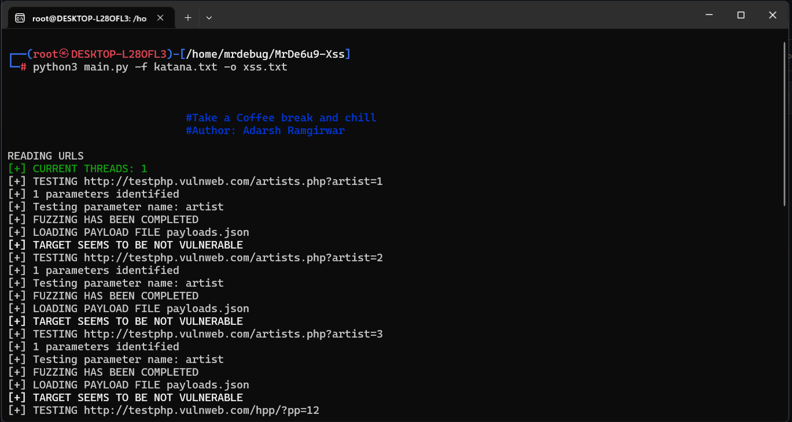
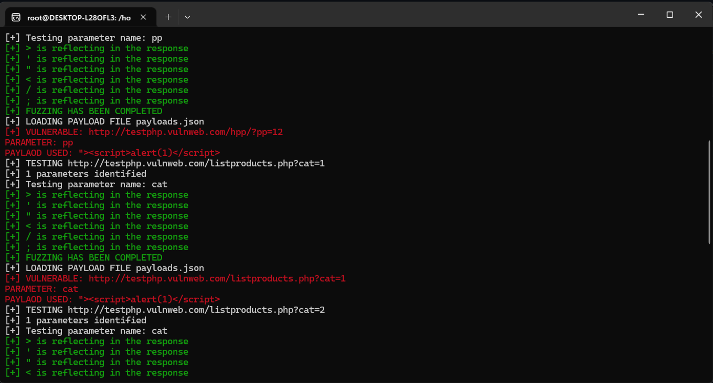

## MrDe6u9-Xss
"Experience the Automation With this tool"




### Features

- Find Xss in easy way
- You can add your payload in the adder.py


### I N S T A L L A T I O N

```
1. Clone the repository: git clone https://github.com/MrDe6u9/MrDe6u9-Xss.git
2. Install the requirements file: pip3 install -r requirements
3. Run the main.py file
```
### To add payload 

 - python3 adder.py
 - " onload=alert(1)

### USAGE
```
python3 main.py -f <filename> -o <output>

-f: Filename that contains bunch of links
-o: Output filename in which all the vulnerable endpoints is stored
-t: No of threads[Increase the threads if you want more speed] (Max: 10)
```
